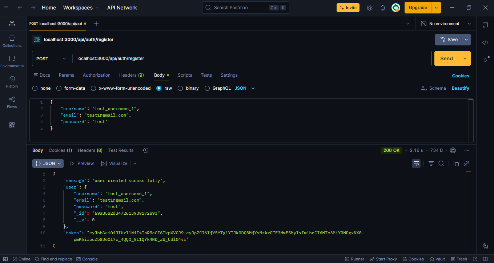
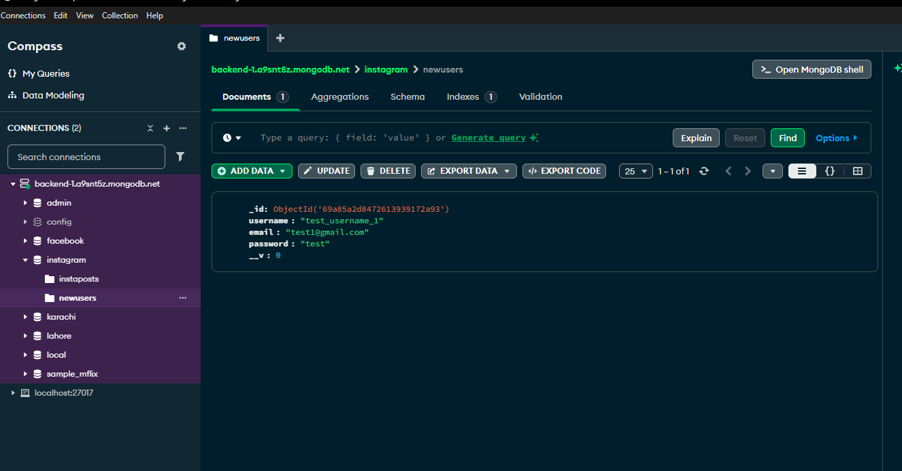

# Express.js User Authentication API

A clean and modular backend starter for handling user registration and authentication using Node.js, Express, and MongoDB.

## 🚀 Features
* **User Registration**: Create new users with hashed passwords (recommended next step).
* **JWT Implementation**: Generates a secure JSON Web Token upon registration.
* **Cookie Storage**: Automatically sends the JWT to the client via HTTP-only cookies.
* **Database Integration**: Connects seamlessly with MongoDB Atlas or local MongoDB using Mongoose.
* **Clean Architecture**: Separated concerns using Controllers, Models, and Routes.

-PNG
### API Testing (Postman)

### Database View (MongoDB)

## 🛠️ Tech Stack
* **Runtime**: Node.js
* **Framework**: Express.js
* **Database**: MongoDB (via Mongoose)
* **Auth**: JWT (jsonwebtoken)
* **Middleware**: Cookie-Parser, Dotenv

---

## 📸 API Interaction

### Database View (MongoDB)
When a user registers, the data is structured as a document within your collection:

### API Testing (Postman)
To register a user, send a `POST` request to `/api/auth/register` with a JSON body:

---

